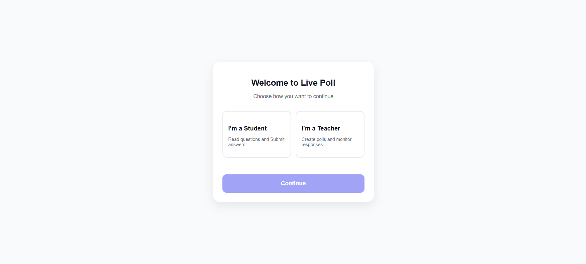
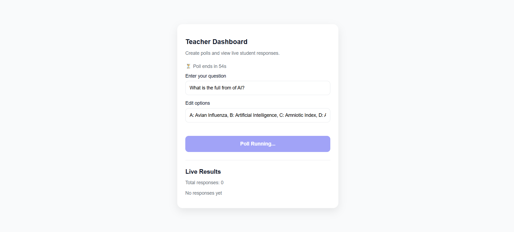
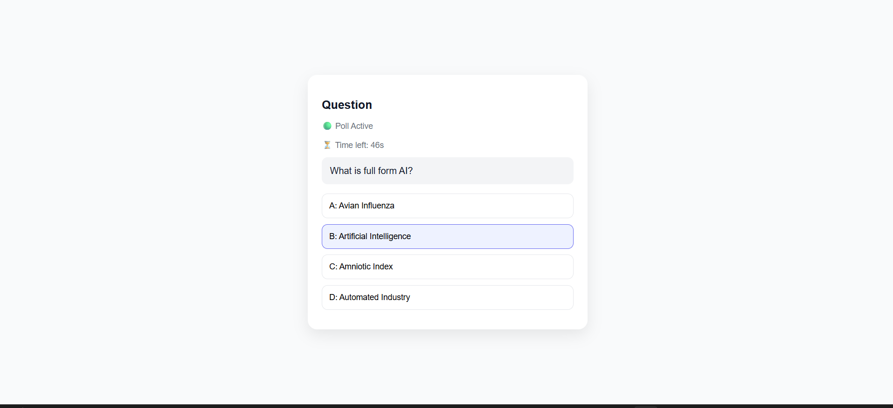
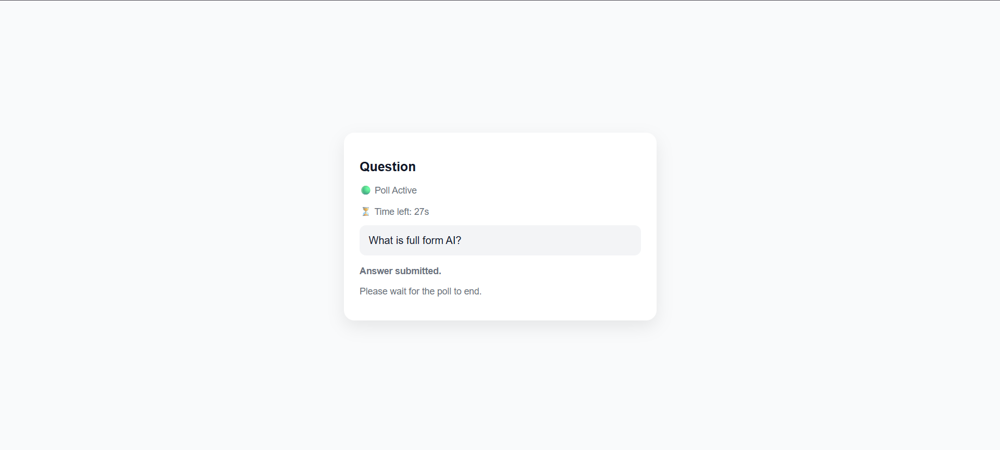
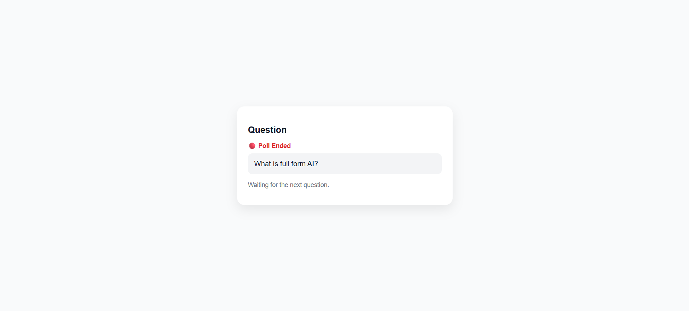
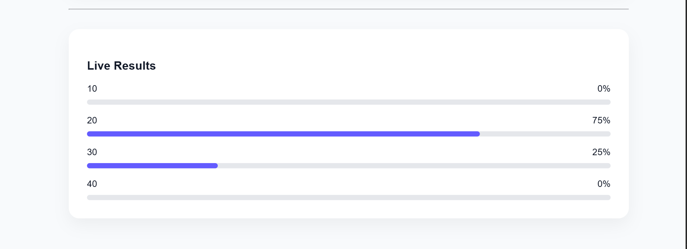

# 🗳️ LivePoll – Real-Time Polling System


A **real-time live polling system** built as part of the  
**Intervue – SDE Intern Technical Assignment**.

This application allows **teachers** to create polls and **students** to submit answers in real time, with **live result visualization** using WebSockets.

---

## 🚀 Live Demo

🔗 **Application URL**  
https://intervue-live-polling-system-rho.vercel.app

---

## 🧠 Problem Statement

Design and implement a real-time polling system where:
- Teachers can create polls
- Students can respond instantly
- Results update live for all users

The UI closely follows the **provided Figma design** and focuses on clean UX and responsiveness.

---

## 🛠️ Tech Stack

### Frontend
- ⚛️ React.js
- 🔌 Socket.io Client
- 🎨 CSS (Responsive UI)

### Backend
- 🟢 Node.js
- 🚀 Express.js
- 🔴 Socket.io
- 🌐 CORS

### Deployment
- 🌍 Frontend: **Vercel**
- 🖥️ Backend: **Render**

---

## ✨ Key Features

### 👨‍🏫 Teacher Panel
- Create polls with a question and multiple options
- View live poll results in real time
- Automatic poll timeout (60 seconds)
- Live progress bar updates
- Create a new poll once the previous poll ends

### 👨‍🎓 Student Panel
- Join and view live polls instantly
- Submit only **one answer per poll**
- Selected option is visually highlighted
- Options are disabled after submission
- Timer and poll status remain visible until poll ends
- Waiting screen for the next poll

### 🔴 Real-Time Capabilities
- Instant synchronization using WebSockets (Socket.io)
- No page refresh required
- Handles multiple concurrent users
- Server-driven timer ensures perfect sync across users

---

## 📸 Screenshots

### 🏠 Welcome Screen
_Select role: Teacher or Student_



---

### 👨‍🏫 Teacher – Create Poll
_Teacher creates a question and options_



---

### 👨‍🎓 Student – Answer Poll
_Student submits an answer_



---

### ✅ Student – After Submission
_Answer submitted and options disabled_



---

### ⏱️ Poll Ended
_Poll automatically ends after timer_



---

### 📊 Live Results
_Real-time poll results with progress bars_



---


## 🔄 Application Flow

1. User selects role (Teacher / Student)
2. Teacher creates a poll
3. Students receive the poll instantly
4. Students submit their answers
5. Teacher sees live results updating in real time
6. Poll ends automatically after the timeout

---

## ⚙️ Local Setup Instructions

### 1️⃣ Clone the Repository
```bash
git clone https://github.com/chinta-ravi-kumar/intervue-live-polling-system.git
cd intervue-live-polling-system

```
### 2️⃣ Backend Setup
```bash
cd server
npm install
node index.js
```

Backend runs at:
`http://localhost:5000`

### 3️⃣ Frontend Setup

```bash
cd client
npm install
npm start
```

Frontend runs at:
`http://localhost:3000`

### 📂 Project Structure
```bash
intervue-live-polling-system/
├── client/        # React frontend
├── server/        # Node.js backend
└── screenshots/   # README images
```

## 👤 Author

Ravi Kumar Chinta

<<<<<<< HEAD
📧 Email: chintharavikumar9908@gmail.com
=======
📧 **Email:** ravikumar.chinta@sasi.ac.in  
🔗 **GitHub:** https://github.com/chinta-ravi-kumar  
🔗 **LinkedIn:** https://www.linkedin.com/in/chinta-ravi-kumar-a0a763280/
>>>>>>> 468aadcbf4e1443f728c3129d4ba68d6ba598e89

🔗 GitHub: https://github.com/ravi-kumar-chinta

🔗 LinkedIn: https://www.linkedin.com/in/chinta-ravi-kumar-a0a763280/

### ⭐ Support & Feedback

If you find this project helpful or interesting, please consider ⭐ starring this repository.

`Thank you for taking the time to review this project! 😊`